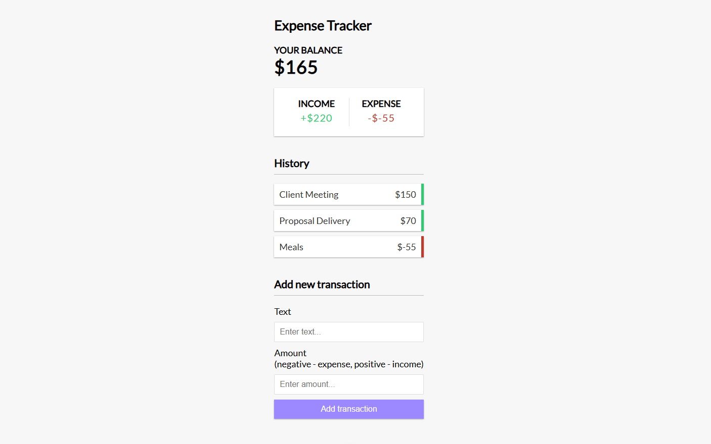
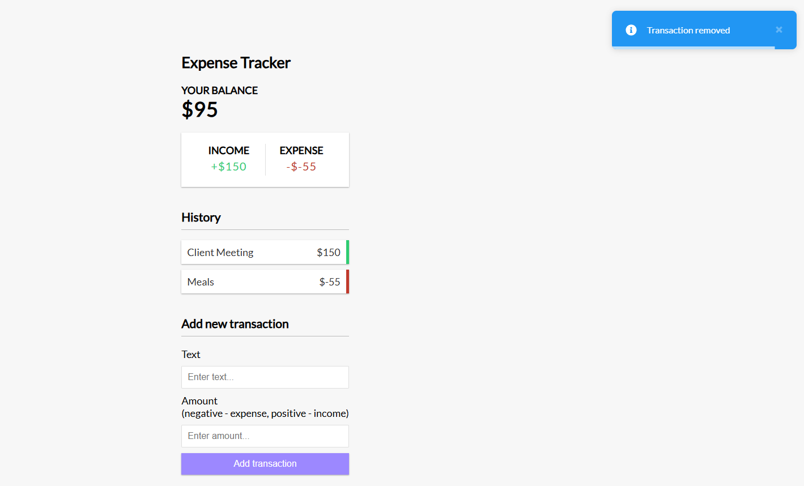
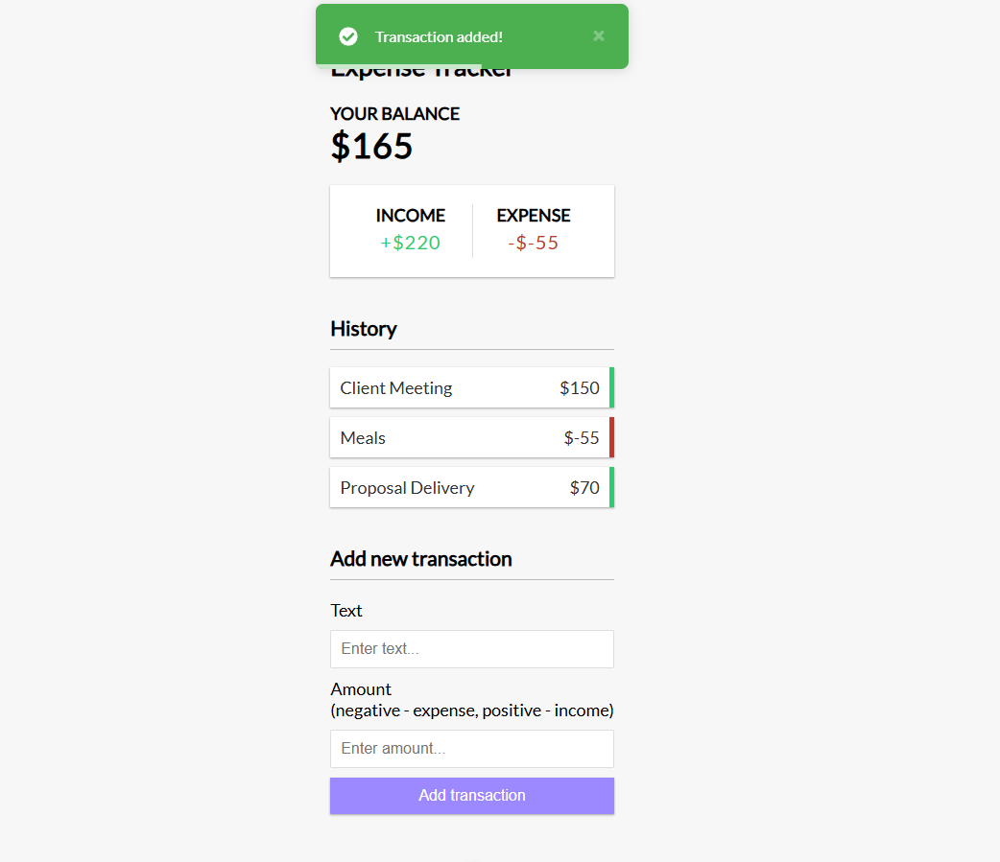

# 💰 Expense Tracker (Vue 3)

A simple and clean **Expense Tracker application** built with **Vue 3 (Composition API)**. It allows users to track income and expenses, automatically calculates totals and balance, and provides instant feedback using **toast notifications**. Data is persisted using **localStorage**.

---

## 📸 UI Preview

### Main Dashboard



---

### Transaction Removed Toast



---

### Transaction Added Toast



---

## ✨ Features

* ➕ Add income and expense transactions
* ➖ Delete existing transactions
* 📊 Automatic calculation of:

  * Total Income
  * Total Expense
  * Current Balance
* 💾 Persistent data using **localStorage**
* 🔔 Toast notifications for user feedback

  * Success (transaction added)
  * Info (transaction removed)
  * Error (invalid input)
* ⚡ Built with Vue 3 `<script setup>` syntax

---

## 🛠️ Tech Stack

* **Vue 3**
* **Composition API**
* **vue-toastification**
* **Browser localStorage**

---

## 📂 Project Structure

```bash
src/
├── App.vue
├── main.js
└── assets/
```

---

## 🚀 Installation & Setup

### 1️⃣ Install dependencies

```bash
npm install
```

### 2️⃣ Install toast notifications

```bash
npm install vue-toastification
```

### 3️⃣ Run the development server

```bash
npm run dev
```

The app will be available at:

```
http://localhost:5173
```

---

## 🧠 How It Works

### 🔹 State Management

* Transactions are stored in a reactive `transactions` array
* Form inputs are handled using reactive refs

---

### 🔹 Persistence

* All transactions are saved to **localStorage**
* Stored data is automatically restored on page reload

---

## 🧮 Computed Properties

| Property  | Description                |
| --------- | -------------------------- |
| `income`  | Sum of all positive values |
| `expense` | Sum of all negative values |
| `balance` | Income + Expense           |

---

## 🗑️ Delete Transaction

Each transaction includes a delete button that:

* Removes the transaction from the list
* Updates localStorage
* Displays an **info toast notification**

---

## 🔔 Toast Notifications

* ❌ Error toast when required fields are empty
* ✅ Success toast when a transaction is added
* ℹ️ Info toast when a transaction is removed

---

## 🧪 Validation Rules

* Both **Text** and **Amount** fields are required
* Amount must be a valid number
* Positive value → **Income**
* Negative value → **Expense**

---

## 📌 Notes

* Simple object-based transaction storage
* Data persists after page refresh
* Ideal for beginners practicing Vue 3 Composition API

---

## 🧑‍💻 Author

**Mohammad Mashaikh**

---

## 📄 License

This project is open-source and available under the **MIT License**.
